Panel Regression - Internet Subscriptions Analysis
================
Ahmet Zamanis

-   <a href="#purpose" id="toc-purpose">Purpose</a>
-   <a href="#data-preparation" id="toc-data-preparation">Data
    Preparation</a>
-   <a href="#exploratory-analysis"
    id="toc-exploratory-analysis">Exploratory Analysis</a>
-   <a href="#pooled-ols-linear-regression"
    id="toc-pooled-ols-linear-regression">Pooled OLS Linear Regression</a>
    -   <a href="#lm1-gdp-predicting-broadband-subs"
        id="toc-lm1-gdp-predicting-broadband-subs">lm1: GDP predicting broadband
        subs</a>
-   <a href="#panel-regression" id="toc-panel-regression">Panel
    Regression</a>
    -   <a href="#plm1-fixed-effects-two-way-panel-regression"
        id="toc-plm1-fixed-effects-two-way-panel-regression">plm1: Fixed
        effects, two-way panel regression</a>
-   <a href="#conclusion" id="toc-conclusion">Conclusion</a>

## Purpose

Panel data consists of repeated measurements of the same variable across
different time points, and often different groups. A typical example
from the business world would be sales data over time, and across
different geographical regions.  
  
Applying a linear regression model with panel data can be misleading,
due to the unobservable effects of different time points and groups that
will be likely present. Other predictors’ significances and effects may
be biased by time and group effects. Panel regression is used to hold
the unobservable effects of time and groups constant, and to isolate the
actual effect of the predictor variables. This analysis aims to
demonstrate such a case.

## Data Preparation

This example analysis aims to discover the global relationship between
income levels, and access to broadband internet connections. The data is
sourced from World Bank Open Data, and includes the two following
datasets:

-   GDP per capita, adjusted for PPP, in 2022 dollars, between
    2000-2020, for 217 countries,
-   Broadband internet subscriptions per 100 people, between 2020-2020,
    for 217 countries.

The raw datasets are in wide format.  

``` r
df_gdp[50:53,10:13]
```

    ##    X2008..YR2008. X2009..YR2009. X2010..YR2010. X2011..YR2011.
    ## 50             ..             ..             ..             ..
    ## 51       27005.29       26890.92       26884.27       27224.40
    ## 52       34830.24       33884.88       33423.50       33313.58
    ## 53       27974.49       27761.51       27881.97       29001.37

``` r
df_net[50:53,10:13]
```

    ##    X2008..YR2008. X2009..YR2009. X2010..YR2010. X2011..YR2011.
    ## 50           0.02           0.03           0.03           0.04
    ## 51             ..             ..             ..          20.88
    ## 52          18.48          21.49          23.15          24.61
    ## 53          16.88          19.41          21.46          23.75

We carry out the following data cleaning and formatting operations:

-   Include matching ID columns in the datasets, to merge them later,
-   Rename country and year columns,
-   Check if country names are identical for each row in both datasets,
-   Convert both datasets to long format,
-   Ensure GDP and subs columns are numeric variables,
-   Ensure country and year columns are factor variables,
-   Convert the subs column from subs per 100 people to subs per 10,000
    people,
-   Convert the GDP column to GDP in thousand dollars,
-   Merge the two long datasets by the ID and year columns,
-   Remove rows with missing observations.

We end up with the following long dataset with 3,324 observations, which
includes:

-   GDP per capita, adjusted for PPP, in thousand dollars, for each
    country and year, excluding years with missing observations,
-   Broadband internet subs per 10,000 people, for each country and
    year, excluding years with missing observations.

``` r
df[50:53,]
```

    ##     ID year    country subs   GDP
    ## 69 101 2005 Kazakhstan    2 13.93
    ## 70 101 2006 Kazakhstan   20 15.73
    ## 71 101 2007 Kazakhstan  172 17.38
    ## 72 101 2008 Kazakhstan  213 17.97

## Exploratory Analysis

Let’s summarize our dataset.  

    ##       year                        country          subs       
    ##  2013   : 187   Austria               :  21   Min.   :   0.0  
    ##  2015   : 187   Belgium               :  21   1st Qu.:  24.0  
    ##  2010   : 185   Bosnia and Herzegovina:  21   Median : 332.0  
    ##  2014   : 185   Brazil                :  21   Mean   : 970.2  
    ##  2019   : 185   Canada                :  21   3rd Qu.:1674.5  
    ##  2016   : 184   Chile                 :  21   Max.   :7852.0  
    ##  (Other):2211   (Other)               :3198                   
    ##       GDP         
    ##  Min.   :  0.500  
    ##  1st Qu.:  4.548  
    ##  Median : 12.120  
    ##  Mean   : 19.822  
    ##  3rd Qu.: 28.832  
    ##  Max.   :153.560  
    ## 

Our panel is slightly unbalanced, due to unavailable data for some years
and some countries. The summary statistics suggest a very right-skewed
distribution for both numeric variables, especially for subs, which is
expected considering how quickly the internet rose from obscurity to
prevalence.  
Let’s look at the histograms and distributions for each variable.  
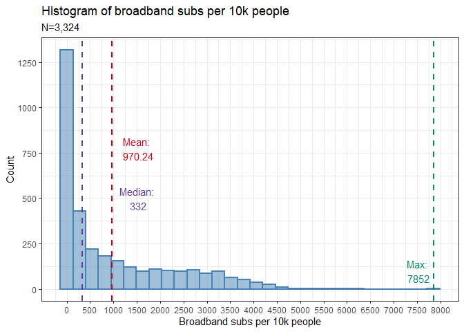<!-- -->  
Broadband subs follow a very right-skewed distribution. The mean and
maximum values are much higher than the median. Most observations are
either zero or below 500.  
  
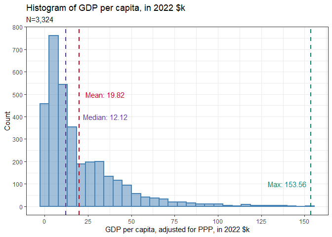<!-- -->  
GDP also follows a right skewed distribution, less so compared to subs.
The mean and median are less far apart, but the mean is still
considerably higher, and the maximum is much higher than the median and
mean.  
  
Let’s plot the relationship between GDP and subs, and test their
correlation.  

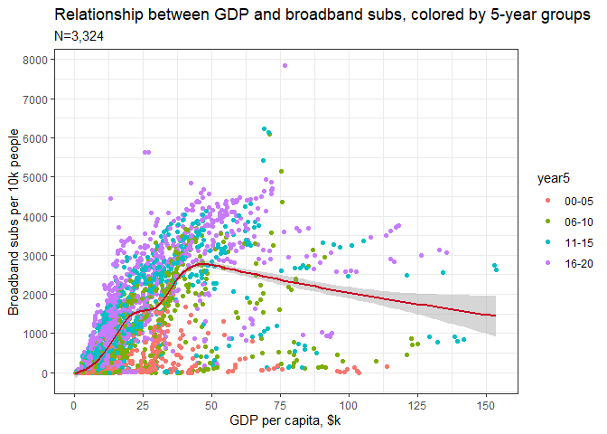<!-- -->  
Apparently, GDP and broadband subs both increase together until roughly
45-50k GDP, but broadband subs actually declines as GDP increases after
that point.

-   Intuitively, we would expect diminishing returns from increased
    income, in terms of internet accessibility.
-   The decline likely not a significant cause-effect relationship, as
    there are very few observations at higher GDP levels.
-   The relationship is reasonably close to a linear increase until
    roughly 45-50k GDP. We may consider limiting our analysis to
    observations with less than 45-50k GDP.
-   From the color-coded 5-year groups, we see the last 5-10 years
    dominantly make up the observations with high broadband subs.

  

    ## 
    ##  Pearson's product-moment correlation
    ## 
    ## data:  df$subs and df$GDP
    ## t = 47.226, df = 3322, p-value < 0.00000000000000022
    ## alternative hypothesis: true correlation is not equal to 0
    ## 95 percent confidence interval:
    ##  0.6130003 0.6537013
    ## sample estimates:
    ##       cor 
    ## 0.6337893

A correlation test between GDP and subs suggests a statistically
significant correlation coefficient of 0.63. There is a moderate
positive correlation between GDP and subs.  
  
What about the changes in GDP and subs over the years, and across
countries? We would expect large and significant effects due to these
two factors. Since there are 217 countries in our dataset, we will skip
plotting the relationship between country and subs/GDP, but we can plot
the relationships with year.  
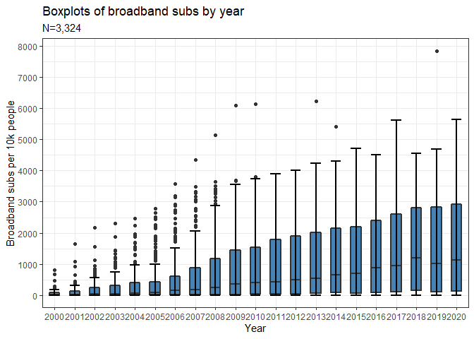<!-- -->  
The relationship between year and subs appears to be a linear-like
increase.

-   Across the years, the maximum number of subs has increased much more
    compared to the median number of subs.
-   Before 2008-2009, there are a lot of outliers in the number of subs
    per year. Outliers mostly disappear afterwards.
    -   It appears that internet usage was more concentrated in some
        countries before these years, and became more globally
        widespread afterwards.

  
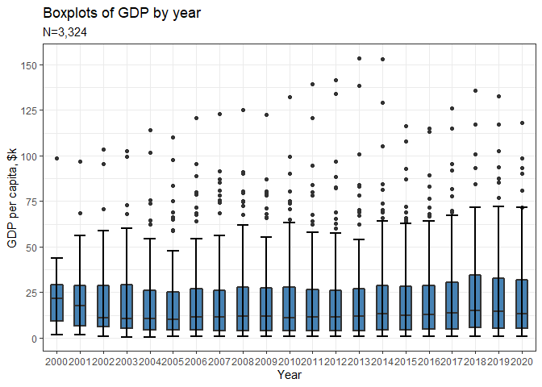<!-- -->  
There is no clear relationship between year and GDP. The median GDP for
each year is very close, except for 2000-2001 when it was slightly
higher. This is likely because there is less data available for poorer
countries in previous years.

-   There are a lot of outliers, especially after 2003, which may
    indicate that the income inequality between countries grew over the
    years.

  
What about considering broadband subs as a predictor of GDP per capita?
Let’s plot the relationship, this time placing subs on the X axis.  
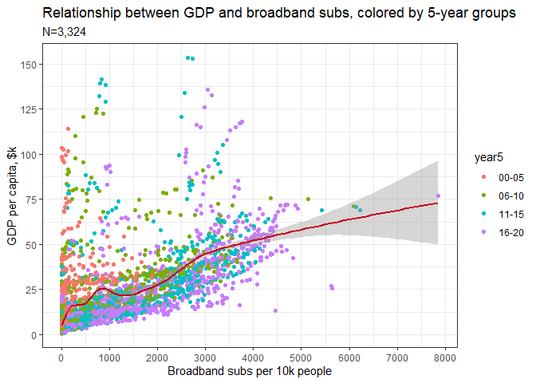<!-- -->  
Overall, there seems to be a positive relationship that can be decently
linearly approximated.

-   There are numerous outliers with more than roughly 50k GDP, but with
    low-medium numbers of broadband subs.
-   Again, the observations with higher numbers of subs are dominated by
    later years.

## Pooled OLS Linear Regression

### lm1: GDP predicting broadband subs

Let’s start our regression analysis by fitting a simple Pooled OLS model
with GDP as the predictor, and subs as the dependent variable. Let’s
limit the dataset to observations with no more than 45k in GDP, as the
relationship becomes unclear after this value, due to few observations.

``` r
df_lm1 <- subset(df, GDP<=45)

lm1 <- lm(subs ~ GDP, data=df_lm1)
summary(lm1)
```

    ## 
    ## Call:
    ## lm(formula = subs ~ GDP, data = df_lm1)
    ## 
    ## Residuals:
    ##     Min      1Q  Median      3Q     Max 
    ## -2796.0  -281.3    -8.8   211.0  4078.6 
    ## 
    ## Coefficients:
    ##             Estimate Std. Error t value             Pr(>|t|)    
    ## (Intercept) -152.665     19.067  -8.007  0.00000000000000168 ***
    ## GDP           66.786      1.045  63.896 < 0.0000000000000002 ***
    ## ---
    ## Signif. codes:  0 '***' 0.001 '**' 0.01 '*' 0.05 '.' 0.1 ' ' 1
    ## 
    ## Residual standard error: 669.9 on 2952 degrees of freedom
    ## Multiple R-squared:  0.5804, Adjusted R-squared:  0.5802 
    ## F-statistic:  4083 on 1 and 2952 DF,  p-value: < 0.00000000000000022

-   The model lm1 shows GDP as a very significant predictor of subs,
    with a p value of 0.
-   For 1 unit ($1000) of increase in GDP per capita, the model predicts
    an increase of 67 in broadband subs per 10,000 people.
-   The intercept is negative, with a value of -153. This means the
    model predicts a negative GDP per capita for a country with zero
    broadband subs per 10k people. Of course, this is not realistic. The
    intercept comes with a high standard error of 19.
-   The maximum residuals go as high as 4080, and the minimum residuals
    as low as -2800. This indicates that some observations are vastly
    overpredicted or underpredicted.

The model explains 58% of the variance for broadband subs in our
dataset.  
  
Let’s test the linear model assumptions and see if our model is
appropriate for this relationship.
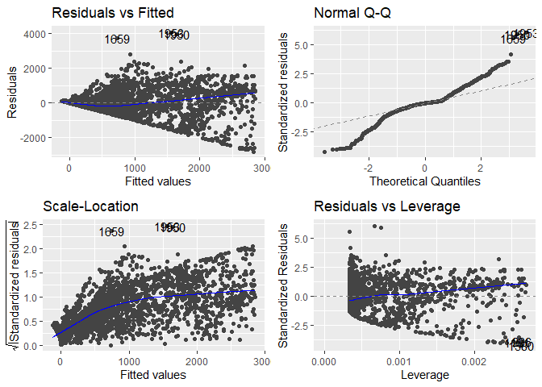<!-- -->  
Our model has several issues:

-   The pattern in the fitted vs. residuals plot suggests that larger
    predictions yield increasingly larger residuals, especially for
    predictions with negative residuals. Smaller predictions are much
    more accurate compared to larger ones.
-   The normality of residuals assumption is violated, especially at the
    highest and lowest quantiles, while middle quantiles are close to
    normal.
-   The scale-location plot shows an increasing pattern, which suggests
    the equal variance assumption is violated. As the model predicts
    higher values, the standardized residuals become larger. Again,
    smaller predictions are much more accurate compared to larger ones.
-   The residuals vs. leverage plot shows several outliers, which is
    expected due to the large number of outliers in both GDP and subs.

Overall, the model has some issues, but after some iteration,
transformations of the outcome and predictor variables didn’t yield much
better fits, so we will keep the model formula as it is.  
  
Let’s plot the observed values of broadband subs against the values
predicted by lm1, as well as the observed values of GDP.  

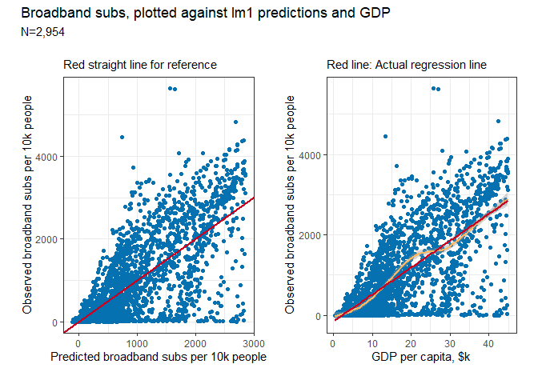<!-- -->  
Overall, the model follows a decent linear approximation, but there is a
high degree of error for many observations.

-   Some predictions are even negative, which is not possible in
    reality. This hints that using just GDP as a predictor of broadband
    subs is not a good approach.

## Panel Regression

The linear model we fit predicts subs using GDP as a predictor, but does
not consider the likely effects of time and country on internet usage
and subscription numbers, regardless of GDP per capita. We could do this
by including year and country as dummy variables in a linear model, but
we would end up with hundreds of coefficients.  
  
A common issue with panel data such as ours is autocorrelation: The
correlation between the predictor variable (GDP) at a certain time
point, and its different values across different time points. Let’s
check if this is an issue with our lm1 model:

    ##  lag Autocorrelation D-W Statistic p-value
    ##    1       0.8117103     0.3760894       0
    ##  Alternative hypothesis: rho != 0

The Durbin-Watson test is very significant with a p value of 0, showing
a correlation coefficient of 0.81. This suggests that time has a very
significant effect on GDP, and we would intuitively expect the same for
country. To account for the unobservable effects of time (year variable)
and groups (country variable), and estimate the true, isolated effect of
GDP on subs, we can use panel regression.  
  
Fixed effects panel regression assumes that unobservable effects are
specific to each group, co-vary with the predictors and all have the
same constant variance. FE regression can only account for
group-specific unobservable effects.  
  
Random effects panel regression assumes the unobservable effects do not
co-vary with the predictors and have differing, randomly distributed
means and variances. RE regression can account for both group-specific
and between-groups unobservable effects.  
  
Intuitively, we would expect the unobservable effects on internet usage
to be closer to the fixed effects assumptions, as the time and group
effects on internet adoption are likely to also affect the GDP per
capita, or be affected by it.  
  
Let’s fit one FE model and one RE model, with the same formula and data
as lm1, but accounting both for year and country effects.

``` r
plm1 <- plm(subs ~ GDP, data=df_lm1, index=c("country", "year"), model="within", 
         effect="twoways")
plm2 <- plm(subs ~ GDP, data=df_lm1, index=c("country", "year"), model="random", 
            effect="twoways")
```

Let’s choose between plm1, the FE model, and lm1, the Pooled OLS model,
using the Chow test for poolability:

    ## 
    ##  F test for twoways effects
    ## 
    ## data:  subs ~ GDP
    ## F = 37.525, df1 = 206, df2 = 2746, p-value < 0.00000000000000022
    ## alternative hypothesis: significant effects

The p-value of 0 suggests that there are highly significant unobservable
effects under the FE assumptions. In other words, the slopes for the
subs \~ GDP regression line are greatly different across groups and time
points. We should use a FE model over a pooled OLS model.  
  
Let’s evaluate plm2, the RE model, using the Lagrange multiplier:

    ## 
    ##  Lagrange Multiplier Test - (Honda) for unbalanced panels
    ## 
    ## data:  subs ~ GDP
    ## normal = 58.554, p-value < 0.00000000000000022
    ## alternative hypothesis: significant effects

The p-value of 0 suggests that there are very significant unobservable
effects under the RE assumptions, and we should use an RE model over a
pooled OLS model.  
  
Let’s check between plm1 and plm2, and decide whether to use FE or RE,
using the Hausman test of endogeneity:

    ## 
    ##  Hausman Test
    ## 
    ## data:  subs ~ GDP
    ## chisq = 62.974, df = 1, p-value = 0.000000000000002095
    ## alternative hypothesis: one model is inconsistent

The p-value of 0 leads us to reject the null hypothesis: The
unobservable effects of group and time co-vary along with our predictor,
GDP. We should choose the FE model plm1, over the RE model plm2.

### plm1: Fixed effects, two-way panel regression

Let’s see the results of plm2, along with the results of lm1:

``` r
summary(lm1)
```

    ## 
    ## Call:
    ## lm(formula = subs ~ GDP, data = df_lm1)
    ## 
    ## Residuals:
    ##     Min      1Q  Median      3Q     Max 
    ## -2796.0  -281.3    -8.8   211.0  4078.6 
    ## 
    ## Coefficients:
    ##             Estimate Std. Error t value             Pr(>|t|)    
    ## (Intercept) -152.665     19.067  -8.007  0.00000000000000168 ***
    ## GDP           66.786      1.045  63.896 < 0.0000000000000002 ***
    ## ---
    ## Signif. codes:  0 '***' 0.001 '**' 0.01 '*' 0.05 '.' 0.1 ' ' 1
    ## 
    ## Residual standard error: 669.9 on 2952 degrees of freedom
    ## Multiple R-squared:  0.5804, Adjusted R-squared:  0.5802 
    ## F-statistic:  4083 on 1 and 2952 DF,  p-value: < 0.00000000000000022

``` r
summary(plm1)
```

    ## Twoways effects Within Model
    ## 
    ## Call:
    ## plm(formula = subs ~ GDP, data = df_lm1, effect = "twoways", 
    ##     model = "within", index = c("country", "year"))
    ## 
    ## Unbalanced Panel: n = 187, T = 1-21, N = 2954
    ## 
    ## Residuals:
    ##      Min.   1st Qu.    Median   3rd Qu.      Max. 
    ## -1624.487  -179.698   -18.401   196.955  2401.047 
    ## 
    ## Coefficients:
    ##     Estimate Std. Error t-value              Pr(>|t|)    
    ## GDP 101.3826     2.7196  37.279 < 0.00000000000000022 ***
    ## ---
    ## Signif. codes:  0 '***' 0.001 '**' 0.01 '*' 0.05 '.' 0.1 ' ' 1
    ## 
    ## Total Sum of Squares:    523010000
    ## Residual Sum of Squares: 347270000
    ## R-Squared:      0.33603
    ## Adj. R-Squared: 0.28597
    ## F-statistic: 1389.7 on 1 and 2746 DF, p-value: < 0.000000000000000222

GDP is still a highly significant predictor of broadband subs, with a
coefficient of 101. A 1k$ increase in GDP translates into an increase of
101 in broadband subs per 10k people.

-   However, the model only explains 29% of the variance in broadband
    subs, compared to 58% explained by lm1. As expected, the true,
    isolated effect of GDP is small after controlling for unobservable
    time and group effects.
-   The residuals of plm1 are generally smaller than those of lm1 in
    absolute value, though still high for some observations.
-   The standard error of GDP’s coefficient is also higher in plm1,
    almost three times the value in lm1. The effect of GDP on broadband
    subs is much less certain than lm1 would assume.

Let’s plot the observed values of broadband subs, against the values
predicted by plm1, and the observed GDP values.  

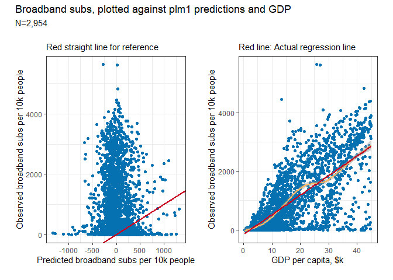<!-- -->  
The predicted vs. actual values plot is very different from lm1’s plot,
and indicates serious trouble. Let’s compare them directly.  
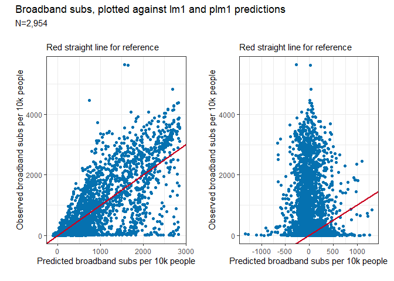<!-- -->

-   The predictions made by lm1 include very few negative values, with
    reasonably small absolute values. The lowest prediction made by lm1
    is -119.
-   In contrast, plm1’s predictions are centered around 0, with more
    negative predictions than positive.

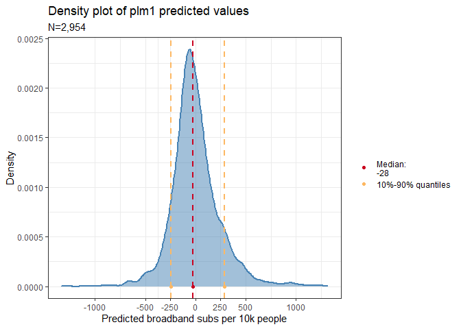<!-- -->

-   The lowest prediction is -1313, and the highest is 1313, while 90%
    of predictions fall between roughly -250 and 250. The median
    prediction is negative, at -28.
-   Clearly, these are very erroneous predictions. This shows that after
    removing the effects of year and country, GDP is actually a poor
    predictor of broadband subs, at least by itself.
-   The much more reasonable predictions of lm1 are because of the
    unobservable effects of year and country affecting the predictions,
    while masquerading as GDP’s effects.

The model summaries showed that plm1’s residuals were generally lower
than lm1, but this can be misleading:

-   The residual is simply the distance between the prediction and the
    observed value. Negative predictions are intuitively wrong, but can
    be “closer” to the observed value, compared to a very large positive
    prediction.
-   For example, if the observed value is 500, a prediction of -500 will
    yield a residual of -1000, while a prediction of 4000 will yield a
    residual of 3500.

## Conclusion

The linear model lm1 showed GDP per capita as a very significant
predictor of broadband subscriptions, explaining 58% of the variance.
lm1 didn’t satisfy the normality of residuals assumption, but came
reasonably close, which is difficult for large datasets and with high
numbers of outliers. The predictions for many observations had a high
degree of error.  
  
However, we suspected that year and country had significant,
unobservable effects on broadband subscriptions that may bias GDP’s
effect as a predictor, and our suspicions were confirmed with the
relevant statistical tests.

-   We used a fixed effects panel regression model, plm1, to isolate the
    true effect of GDP, from the unobservable effects of year and
    country.
-   While GDP remained as a statistically significant predictor of
    subscriptions, it only accounted for 29% of the variance, confirming
    our suspicions. The increase in broadband subscriptions are mostly
    due to factors other than GDP per capita.
-   Furthermore, plm1’s fitted vs. observed values plot showed us that
    plm1’s predictions for broadband subs are centered roughly around
    zero, with an almost equal number of positive and negative
    predictions. This tells us that GDP per capita, at least by itself,
    is a poor predictor of broadband subs.

Had we only applied a Pooled OLS linear regression model, without
accounting for the effects of year and country, we would have wrongly
inferred that GDP per capita explained a large proportion of the
variance in broadband subscriptions, and generated reasonable
predictions by itself. This shows us the importance of using panel
regression, and accounting for the effects of time and groups, when
working with panel data.
